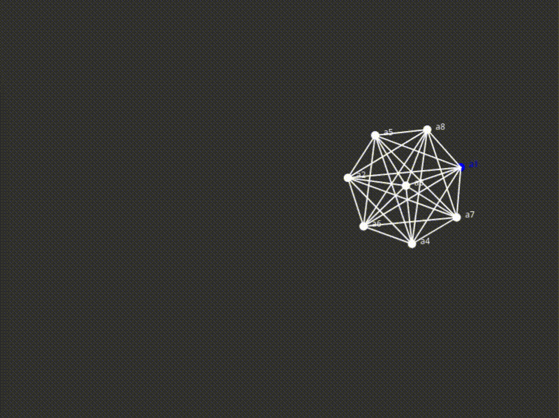

# Force-Directed Graph Layout

Arranges the graph vertices by simulating two forces:

-   Repulsive force between each of the vertices.
-   Attractive force of elasticity between the vertices connected by edges.

## Built with

-   JavaScript
-   p5.js

## Example

